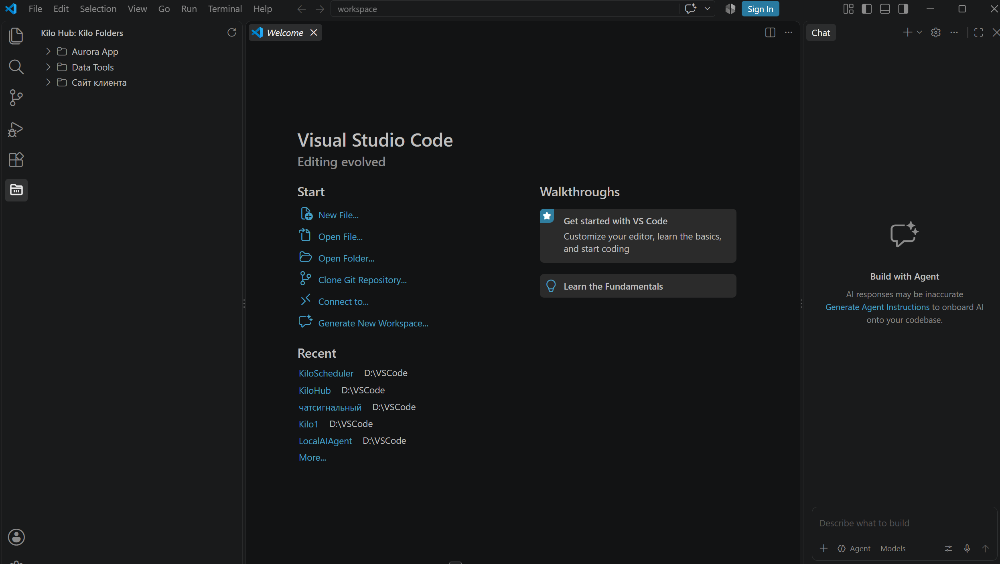
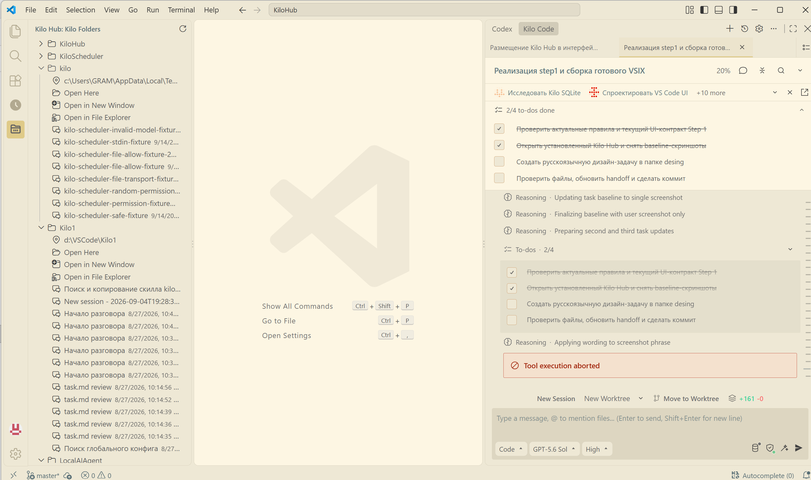

# Задача на дизайн окна Kilo Hub Step 1

## Контекст

Kilo Hub — локальное Windows-расширение VS Code. В Step 1 оно показывает в Activity Bar папки, в которых есть обычные неархивные root sessions Kilo Code, и позволяет открыть выбранную папку.

Текущая версия уже реализована как нативный VS Code `TreeView`. Задача дизайнера — предложить более ясное и аккуратное представление **того же самого функционала**, не расширяя продуктовый scope.

## Цель дизайн-задачи

Сделать окно понятным с первого взгляда и удобным при большом количестве папок и диалогов, сохранив визуальный язык VS Code и все существующие ограничения Step 1.

Результат должен отвечать на вопросы:

1. Как пользователь быстро различает папки, действия и названия диалогов?
2. Как должна выглядеть collapsed folder row, чтобы список легко сканировался?
3. Как лучше оформить раскрытую папку без визуального шума?
4. Как показать missing, loading, empty и error states средствами нативного VS Code UI?
5. Какие стандартные VS Code icons, labels, descriptions и tooltips использовать?
6. Как сохранить читаемость длинных путей, длинных titles, кириллицы и других non-ASCII названий?

## Неизменяемый функциональный scope

Дизайн не должен добавлять, удалять или менять функции.

В окне остаются только:

- контейнер Activity Bar `Kilo Hub`;
- view `Kilo Folders`;
- ручной `Refresh` в title bar view;
- плоский список папок;
- текущая папка VS Code, если она присутствует в списке, всегда показана первой и имеет понятную нативную пометку `Current`;
- раскрытие и сворачивание folder row;
- полный локальный путь внутри раскрытой папки;
- действие `Open Here`;
- действие `Open in New Window`;
- действие `Open in File Explorer`;
- пассивный список titles диалогов без перехода в диалог;
- дата последней активности у диалога, когда она известна;
- loading, empty, error и missing states;
- disabled actions у missing folder.

## Что запрещено добавлять

- поиск, фильтры, пользовательские сортировки и переключатели; единственное фиксированное исключение — текущая папка всегда первая;
- context menu и дополнительные команды;
- кнопки add/remove/hide/favorite/pin;
- badges, counters или summary, которых нет в текущем scope;
- открытие конкретного диалога;
- preview содержимого диалога;
- чтение или показ message bodies;
- ручной registry папок;
- watcher и автоматический refresh;
- настройки расширения;
- multi-root и `.code-workspace`;
- UNC, WSL, SSH, Dev Containers и другие remote paths;
- webview, custom HTML/CSS, React или отдельная дизайн-система;
- onboarding, telemetry, облачные функции, LLM и AI-summary.

## Технические ограничения дизайна

Окно остаётся нативным VS Code `TreeView`. Реализация доступна через стандартные свойства `TreeItem`:

- `label`;
- `description`;
- `tooltip`;
- `ThemeIcon` и codicons;
- `collapsibleState`;
- `command`;
- `TreeView.message`;
- стандартные цвета темы VS Code.

Нельзя рассчитывать на:

- произвольную сетку, карточки и custom spacing;
- собственные шрифты, CSS, background, border или animation;
- многострочный rich text внутри tree row;
- нестандартные кнопки внутри строки;
- постоянную ширину Side Bar;
- конкретную светлую или тёмную тему.

Предложение должно работать в стандартных dark/light/high-contrast темах и при узкой Side Bar.

## Текущая информационная архитектура

### Collapsed folder

- label: только имя папки;
- icon: `folder`;
- command отсутствует, обычный click раскрывает folder;
- tooltip: полный путь, число диалогов, последняя активность;
- missing folder использует warning icon.

### Current folder

- Current folder — папка, открытая сейчас в активном single-folder окне VS Code.
- Если эта папка присутствует в Kilo Hub, она всегда располагается первой, независимо от времени последней Kilo-активности.
- Пользователю должно быть сразу понятно, что это текущая папка. Используется нативная пометка `Current`; точное сочетание `description`, `ThemeIcon` и tooltip предлагает дизайнер.
- Пометка не является кнопкой, badge с числом или новым действием.
- Если текущая папка отсутствует в Kilo Hub, synthetic row не создаётся.
- Если папка в VS Code не открыта или environment не поддерживается Step 1, пометка не показывается.

### Expanded folder

Порядок дочерних строк фиксирован функциональным контрактом:

1. полный путь;
2. `Open Here`;
3. `Open in New Window`;
4. `Open in File Explorer`;
5. titles диалогов от нового к старому.

Designer может предложить более подходящие стандартные icons, формулировки и использование `description`/`tooltip`, но не может менять назначение строк или добавлять новые действия.

### Conversation row

- пассивная строка без command;
- label: сохранённый title или `Без названия`;
- description: дата при наличии корректного timestamp;
- tooltip: полный title и дата;
- icon: стандартный VS Code icon.

## Состояния для проработки

Нужны отдельные макеты или однозначные annotations для следующих состояний:

1. Загрузка при первом открытии.
2. Пустой список: подходящие Kilo folders не найдены.
3. Обычный список из нескольких collapsed folders.
4. Одна раскрытая доступная папка с 1–5 диалогами.
5. Раскрытая папка с длинным путём и длинными/non-ASCII titles.
6. Missing folder: warning state и disabled actions.
7. Ошибка первого чтения.
8. Ошибка повторного refresh, когда последняя корректная модель остаётся на экране.
9. Refresh выполняется, а старая модель остаётся видимой.
10. Узкая Side Bar и обрезка текста.

## Что требуется от дизайнера

1. Один рекомендуемый вариант, а не набор несвязанных концепций.
2. Макеты dark и light theme для collapsed и expanded состояний.
3. Макет missing/error state.
4. Поведение при узкой ширине Side Bar.
5. Таблица всех строк: label, description, icon/codicon, tooltip, click behavior.
6. Точные тексты UI на английском или рекомендация полной локализации; смешение языков без объяснения не допускается.
7. Список изменений относительно baseline screenshots.
8. Отдельная таблица «можно реализовать нативным TreeView» / «не поддерживается нативным TreeView».
9. Передача результата в формате Figma или PNG плюс краткая specification для разработчика.

## Критерии приёмки дизайна

- Функциональность полностью совпадает с текущим Step 1.
- Не появляется ни одной новой команды, сущности или настройки.
- Folder rows легко сканируются в collapsed состоянии.
- Текущая папка однозначно заметна, находится первой и помечена `Current`, не создавая отдельную сущность или действие.
- Path, actions и conversations визуально различимы без custom UI.
- Missing actions явно недоступны, но остаются видимыми.
- Длинные строки корректно работают через truncation и tooltip.
- Решение не зависит от конкретной темы или фиксированной ширины.
- Для каждого визуального решения указано соответствующее стандартное VS Code API/codicon.
- Предложение реализуемо без webview и CSS.

## Baseline screenshots

Скриншоты показывают установленный VSIX `0.1.0` в реальном интерфейсе VS Code. Для дизайн-анализа используется только левая панель `Kilo Hub: Kilo Folders`; editor, Chat и другие части окна не входят в задачу.

| Файл | Содержание |
|---|---|
| `screenshots/image.png` | Dark theme: несколько папок в collapsed состоянии. |
| `screenshots/image2.png` | Light theme: раскрытые папки, path, три actions, длинные и non-ASCII titles диалогов. |

### Dark / collapsed

### Light / expanded

Baseline фиксирует текущее состояние, а не желаемое решение. Дизайнер не обязан сохранять текущие icons или формулировки, если замена остаётся в пределах нативного TreeView и неизменяемого функционального scope.

`image2.png` содержит локальные paths и session titles, которые являются пользовательскими metadata. Скриншот предназначен только для назначенного дизайнера: не публиковать его, не использовать в портфолио и не переносить видимые значения в итоговые публичные макеты. В дизайн-макетах заменить их обезличенными примерами.
